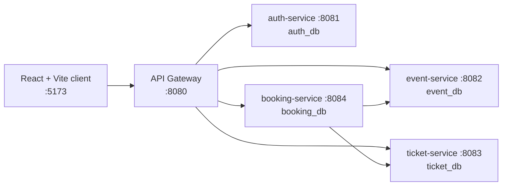

# EventHub (EAD2)

**A microservices-based event management and ticket-booking system** — browse events,
reserve tickets, pay through a simulated checkout, and get a QR e-ticket; admins manage
events, tickets, bookings, and users.

<p>
  
  
  
  
  
  
</p>

> Built for the **Enterprise Application Development** module at NIBM.

---

## Contents

- [Overview](#overview)
- [Screenshots](#screenshots)
- [Architecture](#architecture)
- [Features](#features)
- [Tech Stack](#tech-stack)
- [Project Structure](#project-structure)
- [Getting Started](#getting-started)
- [Configuration](#configuration)
- [API Smoke Test](#api-smoke-test)
- [Testing](#testing)
- [My Role](#my-role)
- [Known Limitations](#known-limitations)
- [License](#license)

## Overview

EventHub splits the backend into five Spring Boot services behind a single API gateway.
Each service owns its own MySQL database and exposes a small REST API; the React client
talks only to the gateway (`http://localhost:8080/api`). Authentication is handled by the
auth service with JWT; the gateway validates the token and forwards the caller's identity
to downstream services as `X-User-Id` / `X-User-Role` headers, so the other services stay
free of auth logic.

The booking flow is: **select tickets → reserve (PENDING) → simulated payment → CONFIRMED →
QR e-ticket + PDF receipt**. Payments are a demo flow only — no real payment provider is
involved.

## Screenshots

<!-- Add screenshots to docs/ and reference them here, e.g.: -->
<!--  -->
<!--  -->
<!--  -->

_Screenshots to be added._

## Architecture



| Service | Port | Database | Responsibility |
| --- | --- | --- | --- |
| **api-gateway** | 8080 | – | Single entry point; routes `/api/{auth,events,tickets,bookings,reports}/**`, CORS, JWT check, injects `X-User-Id` / `X-User-Role` |
| **auth-service** | 8081 | `auth_db` | Register / login (JWT), user CRUD, user count |
| **event-service** | 8082 | `event_db` | Event CRUD, image upload (`Images/`), categories, date-range queries, stats |
| **ticket-service** | 8083 | `ticket_db` | Ticket types per event, availability, reserve / release |
| **booking-service** | 8084 | `booking_db` | Bookings (create, confirm, cancel, expire), payments (simulated) |

> The gateway also has a `/api/reports/**` route reserved for a future report service (port 8085) that is not part of this repo yet.

## Features

**Attendee**

- Register and log in (JWT)
- Browse events, filter by category, view event details
- Select a ticket type and quantity, reserve tickets
- Simulated card payment (name, number, expiry, CVV) with validation and a retry path
- Booking details page with a QR e-ticket and a downloadable PDF receipt
- "My Bookings" with status filtering; cancel a booking

**Admin**

- Dashboard with event / booking / user stats
- Create, edit, delete events (with image upload)
- Manage ticket types and availability per event
- View all bookings, filter by event and status, expire stale pending bookings
- Manage users

## Tech Stack

**Backend** — Java 17, Spring Boot 3.5.7 (Web, Data JPA), Spring Cloud parent, MySQL 8,
Hibernate (`ddl-auto=update`), JJWT 0.11.5, Maven multi-module build.

**Frontend** — React 19, TypeScript 5, Vite 7, React Router 7, MUI 7 + Emotion,
Tailwind CSS 4, Axios, `qrcode.react`, `jsPDF`, `lottie-react`, `dayjs`.

## Project Structure

```
EAD2/
├── Backend/
│   ├── pom.xml                # parent POM, modules listed below
│   ├── api-gateway/           # :8080  request routing
│   ├── auth-service/          # :8081  auth_db
│   ├── event-service/         # :8082  event_db  (+ Images/ upload dir)
│   ├── ticket-service/        # :8083  ticket_db
│   └── booking-service/       # :8084  booking_db
├── Frontend/                  # React + Vite client
│   └── src/{pages,components,services,context,utils,types}
├── test_endpoints.sh          # curl smoke test for booking-service
└── TODO.md
```

## Getting Started

### Prerequisites

| Tool | Version |
| --- | --- |
| JDK | 17 |
| Maven | 3.9+ (or use the bundled `./mvnw`) |
| Node.js | 20+ |
| npm | 10+ |
| MySQL | 8.x running on `localhost:3306` |

### 1. Database

Each service creates its schema automatically on first run
(`createDatabaseIfNotExist=true`, `ddl-auto=update`). You only need a running MySQL
instance whose credentials match the config (default `root` / `1234` — see
[Configuration](#configuration) to change them). The four databases created are
`auth_db`, `event_db`, `ticket_db`, and `booking_db`.

### 2. Backend

From `Backend/`, build once, then start each service in its own terminal:

```bash
cd Backend
./mvnw -q install -DskipTests

./mvnw -q -pl api-gateway     spring-boot:run   # :8080
./mvnw -q -pl auth-service    spring-boot:run   # :8081
./mvnw -q -pl event-service   spring-boot:run   # :8082
./mvnw -q -pl ticket-service  spring-boot:run   # :8083
./mvnw -q -pl booking-service spring-boot:run   # :8084
```

Start the gateway last. Every service exposes `GET /<base>/health` for a quick check
(e.g. `curl http://localhost:8081/auth/health`).

### 3. Frontend

```bash
cd Frontend
npm install
npm run dev
```

Open the Vite URL (default `http://localhost:5173`). The client is configured to call
the gateway at `http://localhost:8080/api`, so all backend services and the gateway must
be running.

## Configuration

Each service reads `src/main/resources/application.properties`. Key values:

| Property | Default | Notes |
| --- | --- | --- |
| `server.port` | 8080–8084 | one per service (see the table above) |
| `spring.datasource.url` | `jdbc:mysql://localhost:3306/<name>_db?createDatabaseIfNotExist=true` | schema auto-created |
| `spring.datasource.username` | `root` | change to your MySQL user |
| `spring.datasource.password` | `1234` | change to your MySQL password |
| `cors.allowed-origins` | `http://localhost:3000,http://localhost:5173,http://localhost:5174` | add your frontend origin if different |
| `file.upload-dir` (event-service) | `Images` | where uploaded event images are stored |

To override without editing files, pass them on the command line, e.g.:

```bash
./mvnw -pl auth-service spring-boot:run \
  -Dspring-boot.run.arguments="--spring.datasource.username=myuser --spring.datasource.password=mypass"
```

## API Smoke Test

With `booking-service` running on `:8084`:

```bash
./test_endpoints.sh
```

It exercises the booking endpoints (`/bookings`, `/bookings/my-bookings`,
`/bookings/{id}/confirm`, `/bookings/{id}/cancel`, `/bookings/expire-pending`, …) with
the `X-User-Id` / `X-User-Role` headers the gateway normally injects.

## Testing

```bash
# backend — per module or all
cd Backend && ./mvnw test

# frontend — lint and type-check
cd Frontend && npm run lint && npm run build
```

Automated test coverage is currently minimal (Spring context smoke tests only); expanding
it is on the backlog.

## My Role

This is my coursework project for the Enterprise Application Development module. I designed
the service split and the gateway routing model, and implemented the Spring Boot services,
the MySQL persistence layer, and the React + TypeScript client.

<!-- If this was a group submission, list teammates and who owned which service here. -->

## Known Limitations

- **Payments are simulated** — the payment form validates input and records a transaction, but no real payment provider is called.
- **Header-based trust** — downstream services trust `X-User-Id` / `X-User-Role` from the gateway and are not meant to be exposed directly.
- **Default local DB credentials** (`root` / `1234`) are committed for convenience; change them for anything beyond local development.
- **`ddl-auto=update`** manages the schema — fine for coursework, not for production migrations.
- **Report service** is routed in the gateway but not yet implemented.
- No containerisation yet; each service is started manually.

## License

Released for academic purposes. No `LICENSE` file is included yet; add one before reuse.
